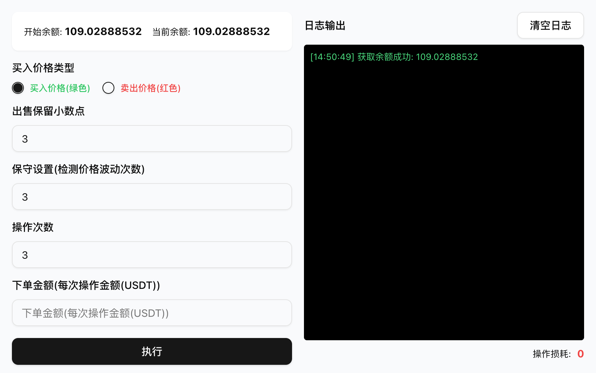

  <picture>
      
  </picture>

## 🚀 Liên kết mời [Nhấn để đi đến](https://accounts.maxweb.black/register?ref=TETAP)

## Giới thiệu dự án

Một công cụ giao dịch Binance Alpha dựa trên tiện ích mở rộng Chrome.

## Các phiên bản khác

Android - [Github](https://github.com/tetap/binance-alpha-auto-android)

Chrome Extension - [Github](https://github.com/tetap/binance-alpha-auto-chrome-extensions)

## Tính năng nổi bật

- **Tự động ghi nhận giao dịch**: Thực thi giao dịch nhanh bằng thao tác theo chiến lược, tối ưu việc quản lý dòng tiền.
- **Tối ưu thưởng/điểm**: Kết hợp chiến lược dòng tiền để nâng cao hiệu quả tích lũy thưởng hoặc điểm một cách thông minh.
- **Lệnh đảo chiều và độ chính xác cao**: Hỗ trợ thiết lập số chữ số thập phân và chiến lược giá đảo chiều, tạo lệnh giao dịch an toàn.
- **Phát hiện biến động giá**: Theo dõi giá thị trường liên tục, hỗ trợ chế độ thận trọng nhằm giảm rủi ro từ biến động bất thường.
- **Xuất nhật ký**: Ghi lại thời gian thực từng vòng giao dịch và kết quả, thuận tiện phân tích hiệu quả giao dịch.
- **Thống kê hao hụt thao tác**: Hiển thị ảnh hưởng của mỗi vòng thao tác lên số dư và việc sử dụng vốn.
- **Hỗ trợ chiến lược nhiều vòng**: Có thể đặt số lần lặp và thực thi chiến lược giao dịch nhiều vòng chỉ với một lần bấm.

## Thông tin chi tiết
[Nhấn để xem](https://jcna3m5r8klj.feishu.cn/drive/folder/OUNgfvBnKlZtqBd84wCc356ynDd?from=from_copylink)

## 💰 Tài trợ hỗ trợ

Mỗi sự ủng hộ của bạn đều là động lực để chúng tôi tiến về phía trước.
Ủng hộ qua WeChat bằng một ly cà phê.

Cảm ơn tất cả những người đã ủng hộ. Nhờ sự hỗ trợ của các bạn mà tôi sẽ càng hoàn thiện thư viện mã nguồn mở này! 🚀

<picture>
    
</picture>

